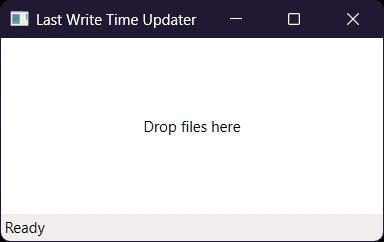

# LastWriteTimeUpdater

Sets the last write time of a file to the current time. I needed this utility to fix the "Cannot sync Due to invalid modification time" problem with NextCloud.

## Usage

Simply drag and drop files into the main window. Recursive directories do not work as of yet.